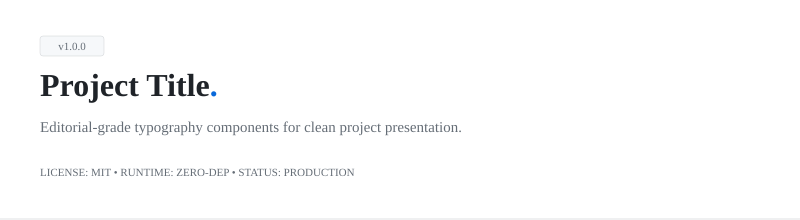

# Brand Readme

**Editorial GitHub README components your designer won't hate.**

<picture>
  <source media="(prefers-color-scheme: dark)" srcset="skills/brand-readme/assets/template-hero-dark.svg">
  <source media="(prefers-color-scheme: light)" srcset="skills/brand-readme/assets/template-hero.svg">
  
</picture>

5 component types. One agent skill for Claude Code, Codex, and Pi. Your brand in 60 seconds — the skill reads your website and maps colors + fonts to every SVG. No Shields.io. No neon pill badges. No 30-minute color-picking sessions.

## Why I built it

Every time I needed a README banner, a stats card, or a tech stack section, I'd get back generic badge soup that looked nothing like the rest of my site. So I built a skill for it. Five component types, editorial quality, matches your brand in 60 seconds by reading your website.

> *The highest-grade design move is deletion. Target visual density: 3/10.*

## What it makes

All 5 components ship in light + dark variants. Self-contained SVGs with inline styles — no build step, no JS, no external images. Drop them straight into GitHub Markdown with `<picture>` tags.

| Component | Purpose |
| :--- | :--- |
| **Hero** | Repository headers, project intros, profile banners |
| **Stats** | Metric callouts, benchmarks, engagement highlights |
| **Stack** | Tech stack categorization without mismatched icons |
| **Timeline** | Changelogs, roadmap progress, version transitions |
| **Quote** | Testimonials, project philosophies, axioms |

## Install

**Pi:**

```
pi install <your-username>/brand-readme
```

**Claude Code:**

```
/plugin install brand-readme@brand-readme
```

**Codex:**

```
npx skills add <repo-url> --skill brand-readme
```

### Editable install

Clone the repo and install the local path if you plan to customize the style guide:

```bash
git clone <repo-url> ~/code/brand-readme

# Pi
pi install ~/code/brand-readme

# Claude Code
ln -s ~/code/brand-readme/skills/brand-readme ~/.claude/skills/brand-readme
```

## Onboarding — make it look like *your* brand

Out of the box, components render in a clean **GitHub editorial palette** (white paper, jet ink, blue accent). Good enough to screenshot straight away. But 60 seconds of onboarding is better.

### The flow

```
You:     "onboard brand-readme to https://yoursite.com"
Agent:   → fetches the homepage
         → extracts dominant palette + font stack
         → maps values to semantic roles: paper, ink, muted, accent
         → verifies WCAG AA contrast
         → shows proposed diff
         → writes tokens to references/style-guide.md
You:     "yes, apply it"
```

### What gets extracted

| Detected from your site | Becomes |
| :--- | :--- |
| `<body>` background | `--paper` token |
| Primary text color | `--ink` token |
| Secondary / caption text | `--muted` token |
| Cards or containers | `--paper-2` token |
| Most-used brand color (CTA, link) | `--accent` token |
| `<h1>` font family | `--font-title` |
| `<body>` font family | `--font-body` |
| `<code>` / `<pre>` font | `--font-mono` |

### Contrast checks happen automatically

Before writing tokens, the skill verifies WCAG AA contrast on `ink` over `paper`. If your site has a color that fails contrast at SVG text sizes (9–12px), it proposes an adjusted value and explains why.

## Quickstart

```bash
# Preview the template SVGs
open skills/brand-readme/assets/template-hero.svg       # macOS
xdg-open skills/brand-readme/assets/template-hero.svg  # Linux

# In Claude Code, Codex, or Pi, ask:
# "Make me a hero banner for my project: title 'Dataflow', tagline 'Real-time stream processing engine'"
# "Stats card: 1.2ms p99 latency, 14MB memory, 99.8% test coverage"
# "Tech stack: Core (Rust, Tokio, Wasm), Data (Postgres, Redis), Infra (Docker, K8s)"
```

## Architecture

Progressive disclosure. `SKILL.md` is a lean index — it tells the agent how to pick a component and where to look for detail. Each component lives in its own reference file, loaded only when relevant.

```
brand-readme/
├── commands/                         — agent slash commands (future)
├── prompts/                          — prompt templates (future)
├── skills/
│   └── brand-readme/
│       ├── SKILL.md                  — philosophy, routing guide, checklist
│       ├── references/
│       │   ├── style-guide.md        — single source of truth for tokens
│       │   ├── onboarding.md         — URL-to-tokens extraction flow
│       │   ├── component-hero.md     — hero/banner spec
│       │   ├── component-stats.md    — stats/metrics spec
│       │   ├── component-stack.md    — tech stack spec
│       │   ├── component-history.md  — timeline/milestone spec
│       │   └── component-quote.md    — editorial callout spec
│       ├── scripts/
│       │   ├── onboard.py            — token extraction scraper
│       │   └── lint-contrast.py      — WCAG AA contrast linter
│       └── assets/
│           ├── template-hero.svg     — light hero template
│           ├── template-hero-dark.svg— dark hero template
│           └── template-stats.svg    — stats template
└── docs/screenshots/                 — images for this README
```

### What loads when

| You ask for… | Agent loads |
| :--- | :--- |
| "Make me a hero banner" | `SKILL.md` + `references/component-hero.md` |
| "Stats card with metrics" | `SKILL.md` + `references/component-stats.md` |
| "Show my tech stack" | `SKILL.md` + `references/component-stack.md` |
| "Onboard to my site" | `SKILL.md` + `references/onboarding.md` + `references/style-guide.md` |

## The design system (in one paragraph)

One accent color, 1–2 focal elements per SVG. Three font stacks: system sans (titles + body), system mono (metrics, versions, sublabels). 1px hairline borders, no shadows, max border-radius 4px. Every coordinate, width, and gap divisible by 4 — non-negotiable, it's what keeps the components from feeling AI-generated. Target visual density: 3/10 to 4/10.

## Skin lint

Before committing a new SVG, run the contrast linter:

```bash
python3 scripts/lint-contrast.py skills/brand-readme/assets/template-hero.svg
python3 scripts/lint-contrast.py --all skills/brand-readme/assets/
```

## When *not* to use this skill

- **Diagrams and flows** → use `diagram-design`
- **Interactive charts** → SVGs are static; use a real charting library
- **Standard markdown content** → just write markdown
- **More than 5 data points** → use a markdown table

## License

MIT — see [LICENSE](LICENSE).
